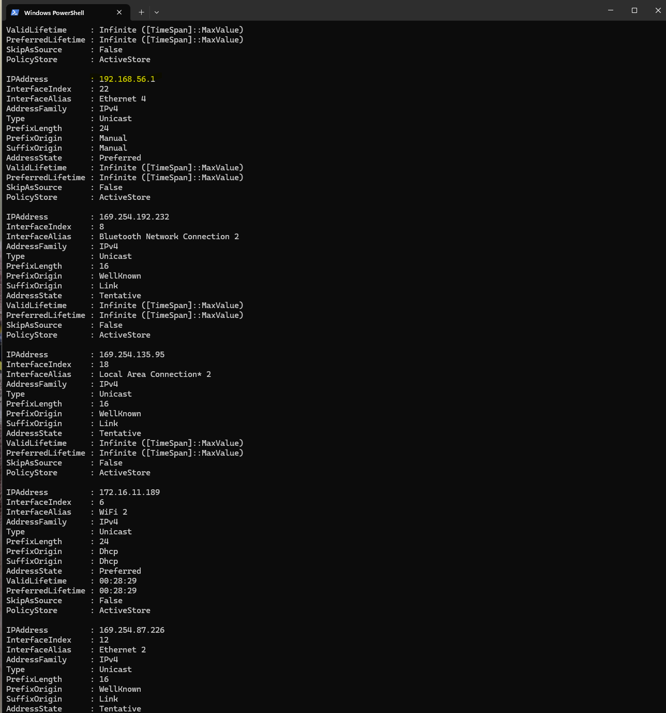
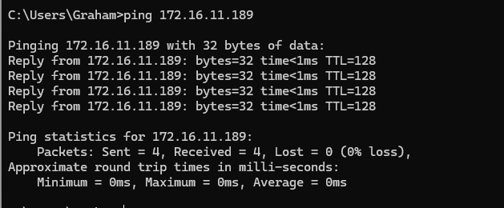

# Week 3 Journal Entry

## Task 1. Knowledge test results

## Task 2.

The command Net-GetIPAddress shows a list of all the addresses on my computer. The primary address is:

192.168.56.1

This also shows the IP Address of my WiFi router as 172.16.11.189.

## Task 3. 

