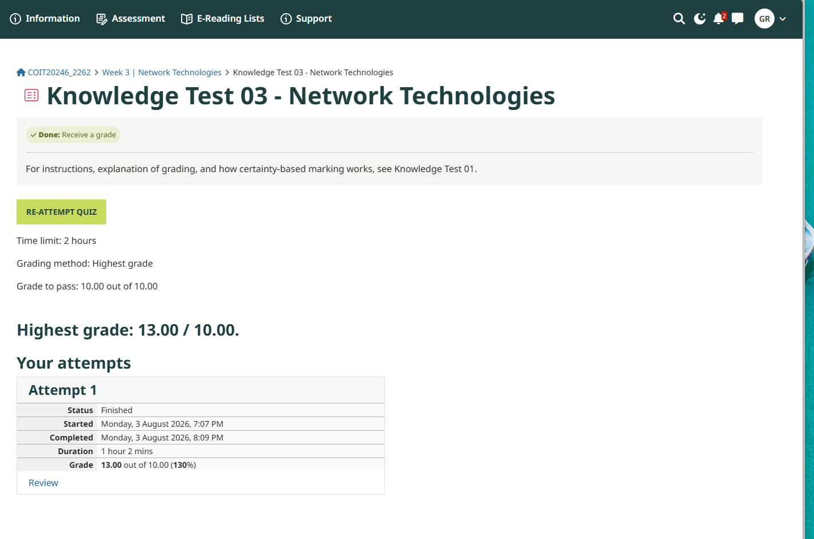
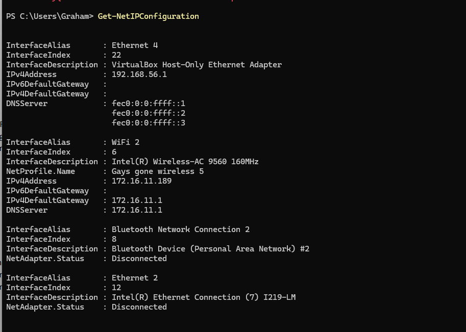

# Week 3 Journal Entry

## Task 1. Knowledge test results

## Task 2.

This command shows that my computer has two IP addresses: 
172.16.11.1 

192.168.56.1

## Task 3. 

![KnowledgeTest Screenshot](./IMAGES/
