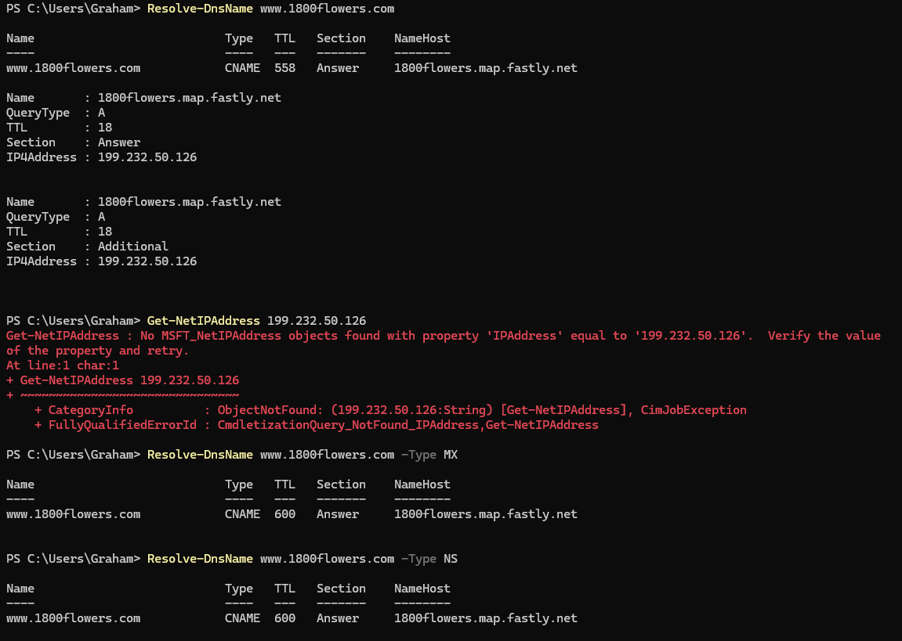

# Week 3 Journal Entry

## Task 1. Knowledge test results

## Task 2.

The command Net-GetIPAddress shows a list of all the addresses on my computer. The primary address is:

192.168.56.1

This also shows the IP Address of my WiFi router as 172.16.11.189.

## Task 3. 

The image above displays the IP address for my local router (WiFi).

The image above displays the ping test that I conducted on my router in CMD.

The minimum delay between my computer and the router is 0ms. The average delay is 0ms and the maximum delay between the computer and router is 0ms. 
There are several factors that can contribute to the delay including number of devices trying to connect to the same router at the same time, the distance from the router and physical obstructions between the router and the device. These factors are variable so it can mean that there is a different delay over the course of time. For example, if a family of five are all home at the same time, the delay could be greater, as opposed to when there is one person at home connecting. 

## Task 4. 
The command to obtain the Linux MAC addresses is ip link.

- eth0 MAC address is 08:00:27:eb:70:43
- eth1 MAC address is 08:00:27:32:11:3e

The command to obtain the IP address is ip addr

- eth0 IP address is 10.0.3.15
- eth1 IP address 192.168.56.2

### Capturing packets Linux Command:

- Enter this command in WRT: tcpdump -i eth0 -n -w taskping.pcap 'arp or icmp'
-     'arp or icmp' is a filter
- Then run the Test Connection command in Powershell (Test-Connection 192.168.56.2. 
- Once completed, go into WRT and stop the capture (CNTRL+C). Open Filezilla and copy the file to the Windows computer.

## Task 5.

The five levels of breach of academic integrity are as follows:
- Level 1: Inappropriate academic conduct
- Level 2: Minor academic misconduct
- Level 3: moderate academic misconduct
- Level 4: Substantial academic misconduct
- Level 5: Serious academic misconduct

## Task 6.
Completed.

## Task 7.
Website: www.1800flowers.com

In Powershell the command Resolve-DnsName www.1800flowers.com provided the IP address of 199.232.50.126

## Task 8.

Wifi Router IP Address: 172.16.11.189

