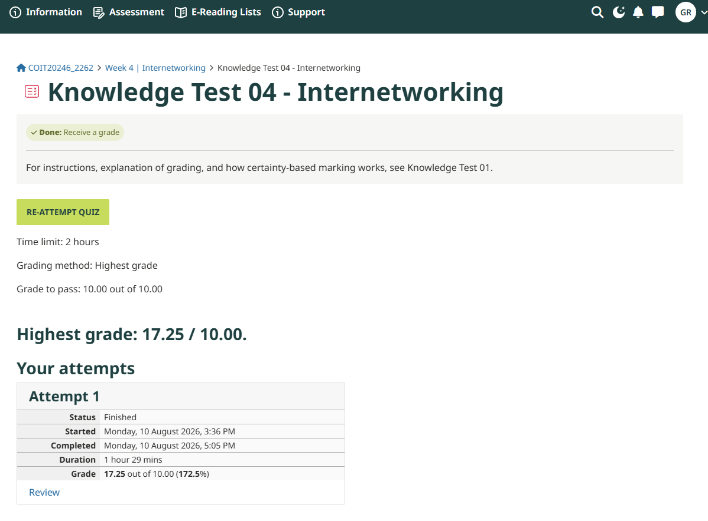
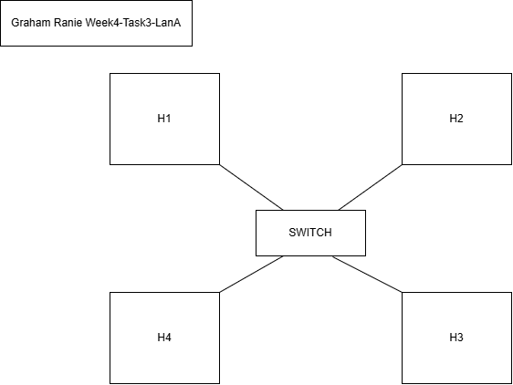
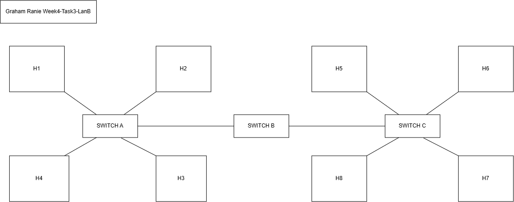
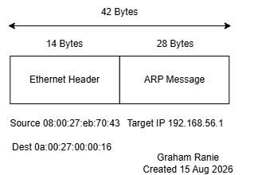
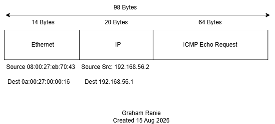

# Week 4 Journal Entry

## Task 1. Knowledge test results

## Task 2.
Projection Initiation - Completed.

## Task 3. Draw Network Diagrams

## Task 4. Analyse Ping Packet Capture

The image above is the ARP packet from my pcap file. The purpose of an ARP is to broadcast a message to all devices on the network to determine which device has the IP address requested. Then that device responds with the MAC address. 

The image above is the ICMP packet from my pcap file. The purpose of an ICMP is the actual ping request. It sends a request to the IP address and the device echos the message back. The time of this request and response provides the ping time. 

## Task 5. View ARP Table

