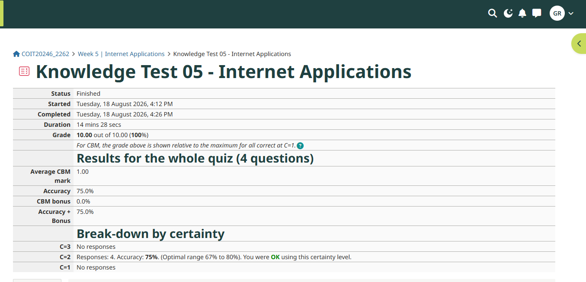
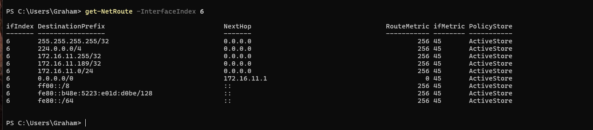

# Week 5 Journal Entry

## Task 1. Knowledge test results

## Task 2. View Routing Table

The routing table shows 9 routes on my computer.

- The first line 255.255.255.25/32 is the local broadcast route. 
- The second line 224.0.0.0/4 is the multicast IP4 route
- The third line is the broadcast address of the local network which is for a directed broadcast and send direct.
- The fourth line shows to send to that device direct.
- the Fifth line says to send directly to anyone on the network,
- The sixth line is to send to anyone else on the internet, send it to 172.16.11.1

## Task 3. IP Network Design

TBC with group project

## Task 4. Academic Integrety Outcomes

**Scenario:** a student has an assignment due on Friday, but they haven't started until Thursday. A friend of theirs offers to provide their own assignment to help write the assignment.

a) They could have started earlier and/or reached out to their lecturer for guidance.

b) This would be a Level 2- Breach of Academic Misconduct as this is considered plagiarism. The likely outcome of this is a downgrade or deduction of marks from the assessment. They may be able to resubmit the assignment for no more that 50% of the pass mark, undertake the assessment with no higher grade than 50% or a referral to the Academic Learning Centre.

c) The ramifications include that the student hasn't learnt what is required of them. This could impact future job prospects because it could create a gap in their knowledge. 

## Task 5 IP Address Lookup

When I run the search on my home computer, the results shows my correct location in Brisbane and it also shows the correct ISP; Gigafy. However, when I run the search on my iPhone, on the same WiFi connection, it incorrectly places my location in Melbourne. Apple does use iCloud private relay which is likely hiding my correct location, hence the discrepancy on my mobile device. The IPv4 addresses on both searches are different and don't match the correct IP address. This is because the service provides a public IP address. This will show, instead of the correct address, for added security. This ensures users to surf the web with added protection. 

