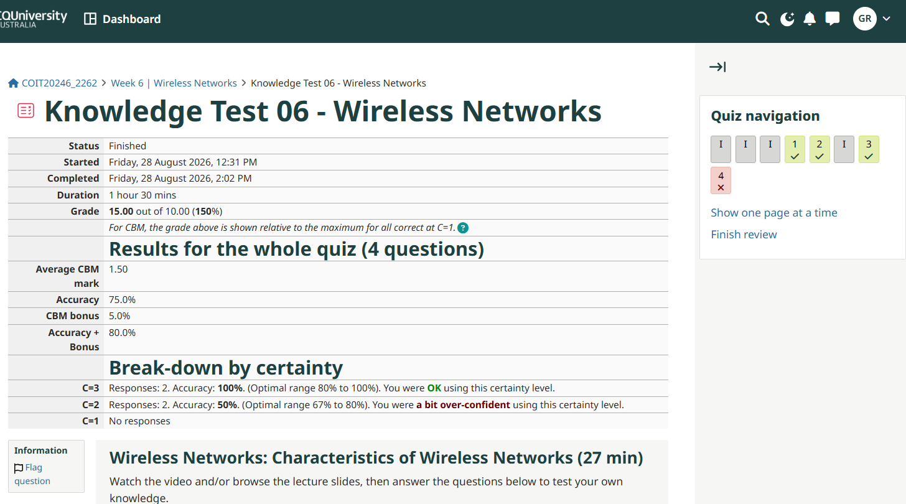
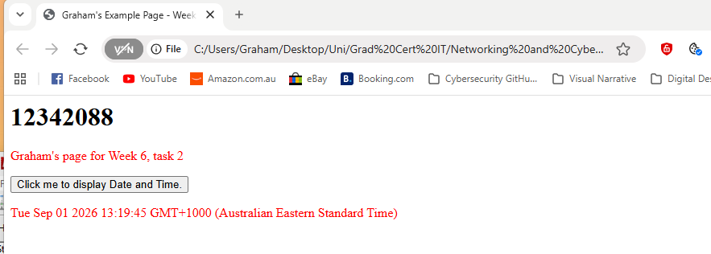
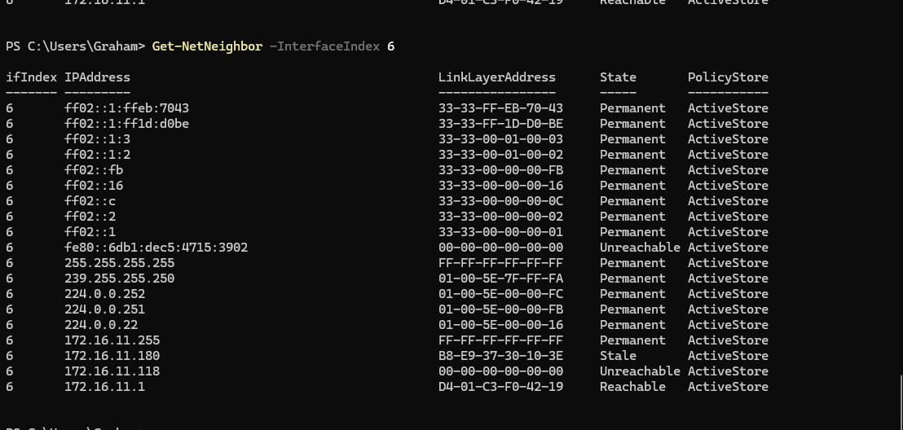
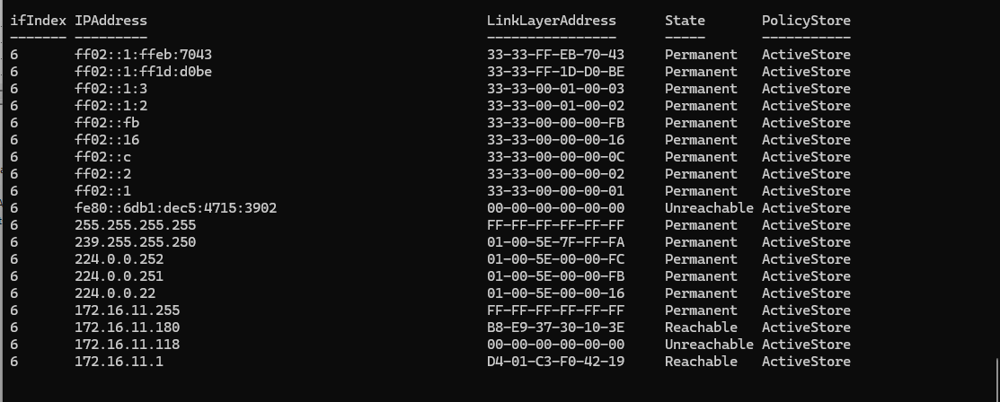
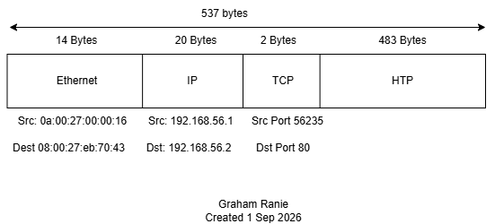

# Week 6 Journal Entry

## Task 1. Knowledge test results

## Task 2. Create webpage in OpenWRT

## Task 3. Capture HTTP Packets

The following device is reachable by my computer: 172.16.11.1. Device 172.16.11.180 showed as "Stale" (image above). So I pinged the device, ran the prompt for the ARP Table again, and it shows as being "reachable". This is demonstrated in the image below..

## Task 4. Analyse HTTP Packet Capture

a) Frame 17 is sending a request and frame 21 is responding ok. Frame 23 sent a request, but frame 26 is responding that the request wasn't found. I'm not entirely sure what this is for. Then frame 28 is sending a request to get my newly created page, and then the response is ok.

b) 
Source IP 192.168.56.1
Destination IP 192.168.56.2
Source MAC Address: 0a:00:27:00:00:16
Destination MAC Address:08:00:27:eb:70:43
TCP Source 56235

c) The browser doesn't show that a request was sent. Because this is Java and it runs locally.

d)

e)The value of the referrer is http://192.168.56.2/. This identifies the request of the web page when requesting the 12342088.html page.   Web servers can use this information to monitor traffic.

f) This learnt that I was using Google Chrome to open the webpage and that I was using Windows.

g) The version of HTTP used is 1.1. The transport protocol being used is TCP. 

h) The TCP began at packet 11 and the data transfer began at packet 17. The time it took was 0.001086 seconds.

i) There was an acknowledgement at packet 12 and 15. The acknowledgement is sent when the destination receives and processes the request.

## Task 5. View Your Cookies
