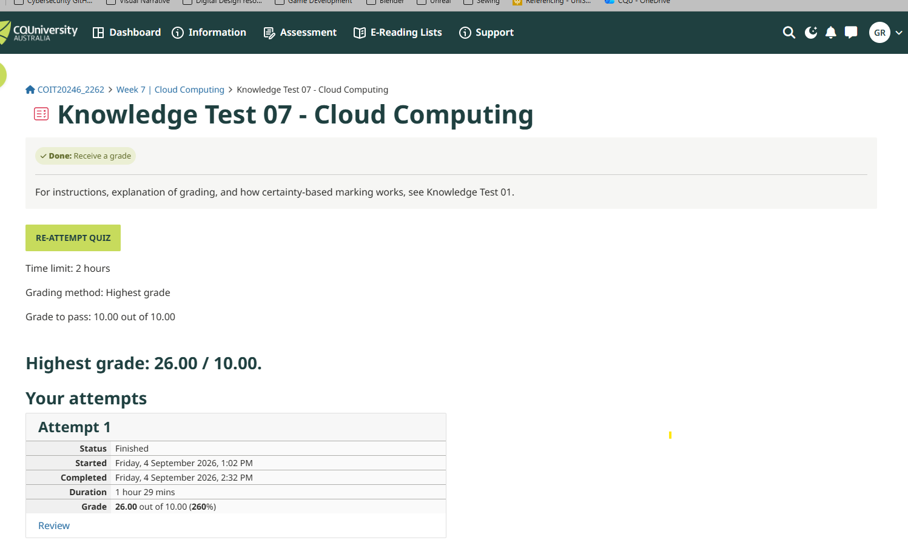
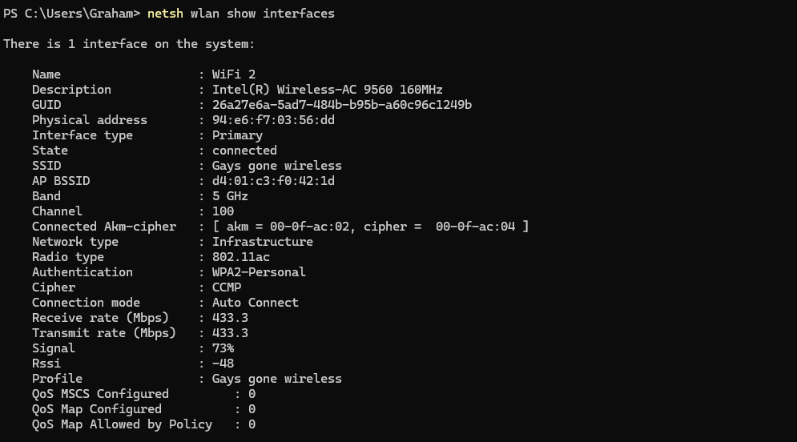
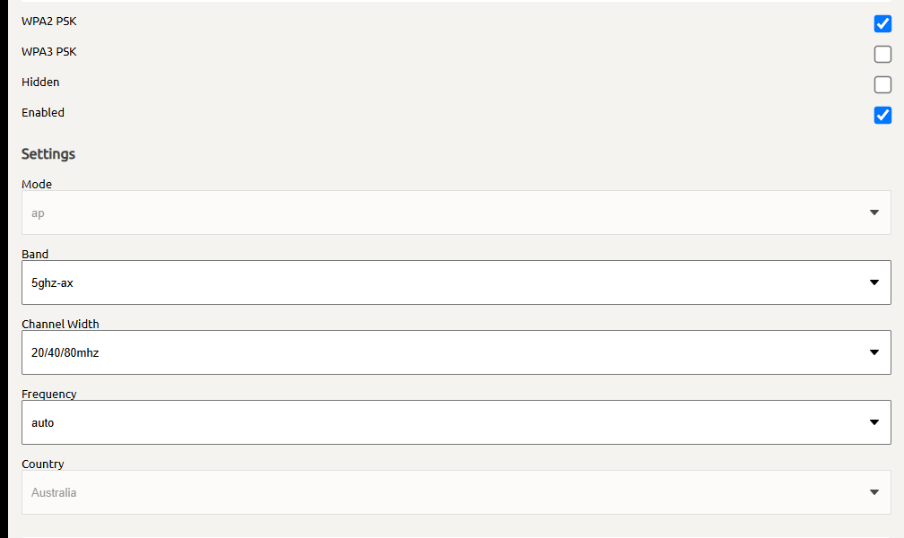
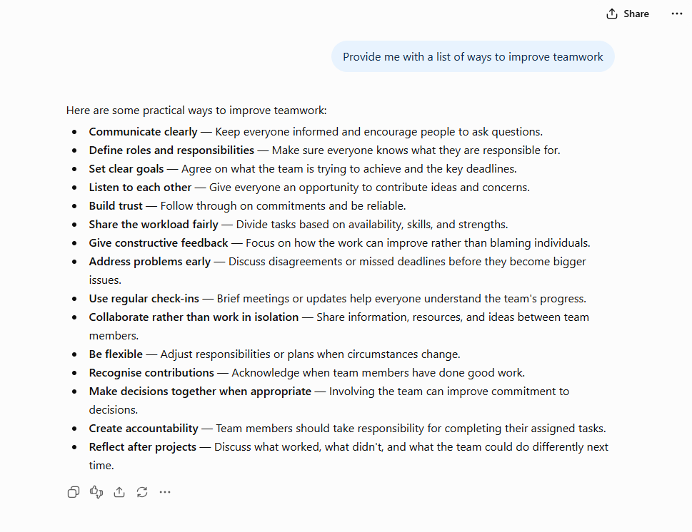

# Week 7 Journal Entry

## Task 1. Knowledge test results

## Task 2. View Wi-Fi Details
- SSID- Gays gone wireless
- BSSID- d4:01:c3:f0:42:1d
- Frequency band- 5GHz
- Channel - 100
- Receive Rate (Mbps) - 433.3
- Transmit Rate (Mbps) - 433.3

## Task 3
When designing a WiFi network, security features needs to be considered. For my own network, the Wi-Fi Protected Access 2 (WPA2) is selected. While WPA2 does have security features, I would consider changing this to WPA3. This is because WPA3 provides enhanced security. 

## Task 4

- **Communicate clearly:** In our weekly catch ups, we discuss what each of our responsibilities are. We ask each other if we need anything from the other person to help.
- **Define roles and Responsibilities** - each week, we set out our work load for the week.
- **Set clear goals** - we have a plan in place, hoping to meet the goals.
- **Listen to each other** - we ask each other questions so that we each contribute.
- **Build Trust** - I could do better in this area. There have been tasks of mine where I have not completed it as agreed.
- **Share the workload fairly** - We divide the tasks.
- **Give constructive feedback** - Hans has provided me feedback on my network diagram.
- **Address problems early** - I don't thing we've come across major problems yet.
- **Use regular checkins** - we catch up weekly and email each other during the week.
- **Collaborate rather than work in isolation** - I will upload work on GitHub so that Hans can view it and provide feedback if necessary.
- **Be flexible** - we've had to adjust a weekly meeting due to conflicting schedules. 
- **Recognise contributions** - I recognised Hans effort in creating the Gantt chart and the weekly tasks.
- **Make decisions together when appropriate** - I will ask Hans for his opinion on my contribution, for example when I completed the network diagram. Hans was able to provide feedback.
- **Create accountability** - we each take responsibility for our own tasks.
- **Reflect after projects** - We haven't reached this stage yet.

