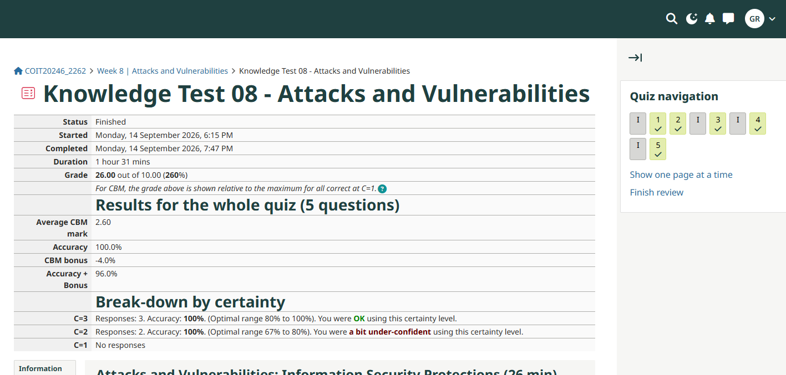
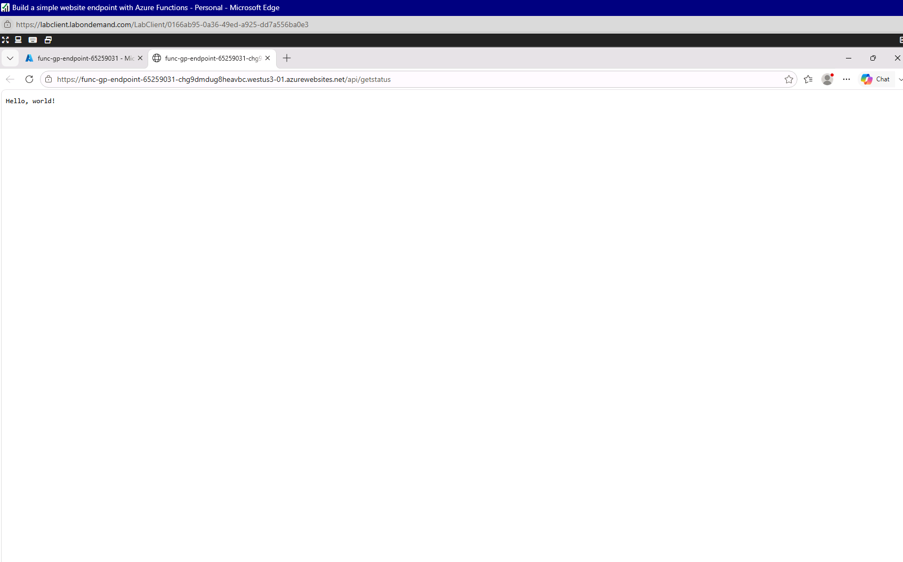

# Week 8 Journal Entry

## Task 1. Knowledge test results

## Task 2. Login to Microsoft Learn on Demand

Completed

## Task 3. Create an Azure Resource
I was a bit confused as to what to do, as the training program has been updated since the instructions were provided and module names and content have been updated. I completed *Module 1: Deploy a Static website with Azure Blob-Storage.*  
In this activity, I created a Resource Group and within this I created the following resources:  
**Storage Account** - This resource is used to host the website files.  
**Static Website Hosting** - This creates a resource where the user can upload the site files and provides a public URL.
**Index and 404 HTML files** - These resources are used to display the webpages.

## Task 4. Create an Azure Virtual Machine and Allow Web Access  
Similiar to task 3, the modules differ now to when the instructions were provided. For this task I have completed *Build a simple website endpoint with Azure Functions.*  

AZ Commands used to create the page:  
mkdir func-gp-endpoint && cd func-gp-endpoint  
func init --worker-runtime node --language javascript --model V4  
func new --name GetStatus --template "HTTP trigger" --authlevel anonymous  
ls src/functions/  
FUNC_APP_NAME=$(az functionapp list --resource-group rg-gp-functions-endpoint --query "[0].name" -o tsv)
echo $FUNC_APP_NAME  
func azure functionapp publish $FUNC_APP_NAME
  
URL of the webpage: https://func-gp-endpoint-65259031-chg9dmdug8heavbc.westus3-01.azurewebsites.net/api/getstatus">func-gp-endpoint-65259031-chg9dmdug8heavbc.westus3-01.azurewebsites.net
  

