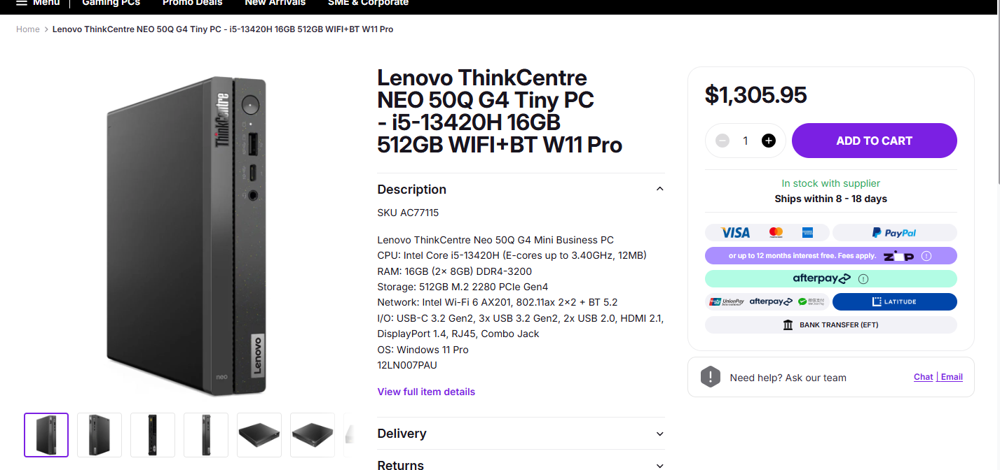
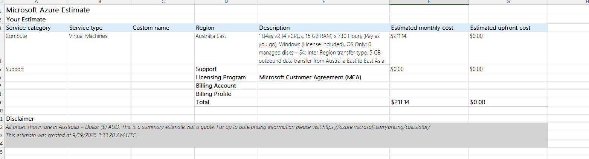

# Week 8 Journal Entry

## Task 1. Knowledge test results

## Task 2. Login to Microsoft Learn on Demand

Completed

## Task 3. Create an Azure Resource
I was a bit confused as to what to do, as the training program has been updated since the instructions were provided and module names and content have been updated. I completed *Module 1: Deploy a Static website with Azure Blob-Storage.*  
  
In this activity, I created a Resource Group and within this I created the following resources:  
**Storage Account** - This resource is used to host the website files.  
**Static Website Hosting** - This creates a resource where the user can upload the site files and provides a public URL.
**Index and 404 HTML files** - These resources are used to display the webpages.

## Task 4. Create an Azure Virtual Machine and Allow Web Access  
Similiar to task 3, the modules differ now to when the instructions were provided. For this task I have completed *Build a simple website endpoint with Azure Functions.*  

AZ Commands used to create the page:  
mkdir func-gp-endpoint && cd func-gp-endpoint  
func init --worker-runtime node --language javascript --model V4  
func new --name GetStatus --template "HTTP trigger" --authlevel anonymous  
ls src/functions/  
FUNC_APP_NAME=$(az functionapp list --resource-group rg-gp-functions-endpoint --query "[0].name" -o tsv)
echo $FUNC_APP_NAME  
func azure functionapp publish $FUNC_APP_NAME
  
URL of the webpage: https://func-gp-endpoint-65259031-chg9dmdug8heavbc.westus3-01.azurewebsites.net/api/getstatus">func-gp-endpoint-65259031-chg9dmdug8heavbc.westus3-01.azurewebsites.net
  

## Task 5. Compare Cloud vs On-premise Costs  
  
|Machine| Cost |
| :-----|-----: |
|Lenovo New 50Q G4 Tiny PC 16GB Ram 512 GB| $1,305.95|
|1 B4as v2 (4 vCPUs, 16 GB RAM) x 730 Hours  Windows (License included)| $211.14 per month|

The initial up-front cost is higher for the desktop PC, however over the 12-month period, the cost of the virtual machine is higher. The initial outlay could be lower for businesses using a virtual machine, and it does come with lower risks. The business would not need to worry about replacing physical equipment or needing to worry about security risks. the cost of the VM also includes a Windows license. However, in the long-term, the VM is going to cost the business more, as 12 months, the business has already spent more on the VM then the one off fee of the desktop PC.  

  
  

  
## Task 6. Create a Storage Blob in Azur  
  
The learning modules did not have this particular module. The closest to the module, was also what I completed in Task 3. However, this did not include any image upload functionality.  

## Task 7. Create a Resource Lock  
Explain the difference between a read-only lock and a delete lock.
  
A delete lock prevents the storage account from being accidentally removed. This allows read and write access but stops it from being deleted until the lock is removed. The red-only lock prevents modifications from being made.
