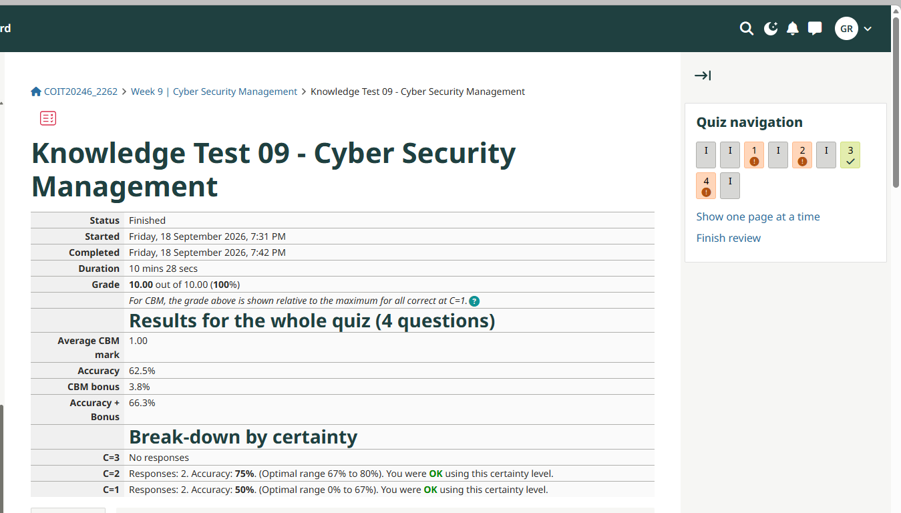

# Week 9 Journal Entry

## Task 1. Knowledge test results

## Task 2. CIA Protections
**Asset 1: Customer Data**  
*Protection:* Confidentiality  
*Reason:* Unauthorised persons, such as external stakeholders, should not see customers data  

**Asset 2: Bank Account Information**  
*Protection:* Confidentiality  
*Reason:* Bank account information for the business and customers, can lead to potential data breaches and theft  

**Asset 3: Wi-Fi Access**  
*Protection:* Availability  
*Reason:* Failure of the Wi-Fi will result in system access issues.

**Asset 4: Financials**  
*Protection:* Integrity  
*Reason:* Theft of money can lead to reputational damage  

## Task 3. Threat Sources and Motivations
• Threat Source 1: Hacker  
Motivation: wants to get access to the company database to steal data to hold to ransom

• Threat Source 2: Thief  
Motivation: wants to steal the company's physical assets 

• Threat Source 3: Natural disaster (storm, fire etc)  
Motivation: the unintended destruction of company property

• Threat Source 4: Vandals  
Motivation: the intentional destruction of company property

## Task 4. Explore Vulnerabilities 

## Task 5. Vulnerability Disclosures
